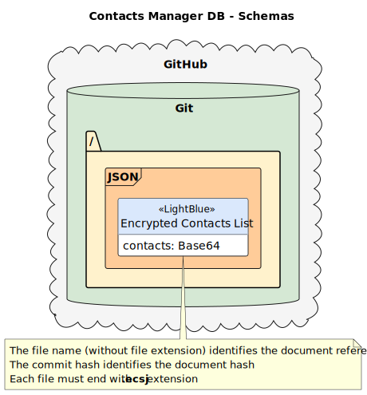

# database

This document records all design decisions for the databases used in the system.

## Contacts Manager DB

The contacts manager database is a file-based database with version control to keep file history. The database is a **single folder** within a Git repository (starting at the root of the filesystem), and this repository is hosted on GitHub (as a private repository).

Each repository file represents a contacts list created by an user, being **encrypted** on the device and saved as a **base64** string on the repository (as a **JSON** document). These files must end with the `.ecsj` file extension.

Insert/Update transactions in the database are represented by **commits** and the commit **hash** is used to verify the **authenticity** of the contacts list, preventing unauthorized **forging** by bad actors.

