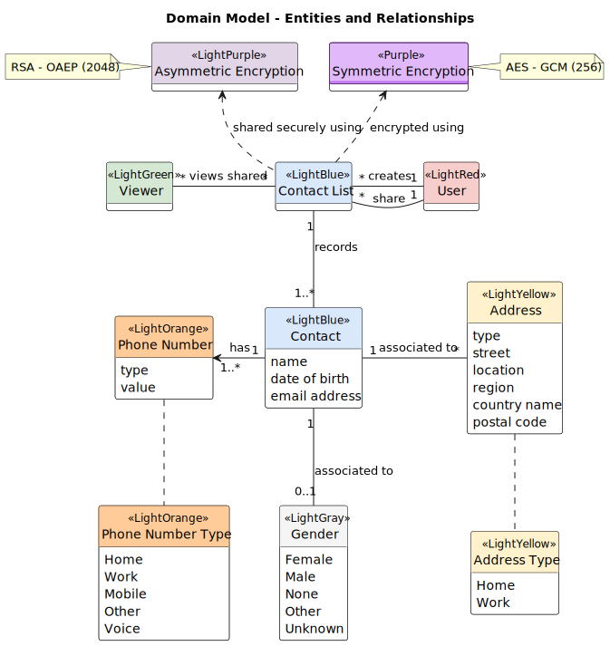

# domain

This document describes all entities of the product as documents and diagrams.

## Domain Model

The diagram below describes all entities and their relationships that fulfill the product domain.

## Encryption Flows

The diagrams below describes how contacts lists are encrypted and decrypted.

The diagram below describes how encryption keys are generated.

