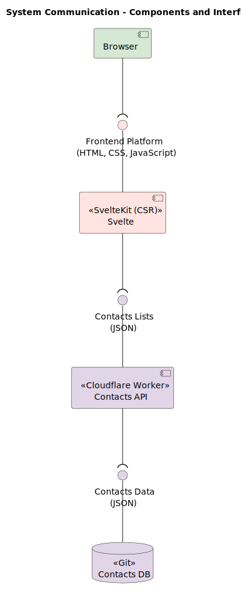

# system

This document describes all system communication of the product as documents and diagrams.

## Design Drivers

The following tables record the **concerns**, **constraints** and quality attributes (**illities**) that lead to design decisions about the system:

|ID|Concern|Addressed in|
|--|-------|-----------|
|CRN-1|Contacts contain PII (Personal Identifiable Information) and thus must be taken with care|`Alpha`|
|CRN-2|Bad actor viewing other users contact lists|`Alpha`|
|CRN-3|Bad actor forging other users contact lists|`Alpha`|

---

|ID|Constraint|Addressed in|
|--|----------|-----------|
|CST-1|The system should be free and serverless (free of maintenance)|`Alpha`|

---

|ID|Illity|Scenario|Addressed in|
|--|------|--------|-----------|
|IL-1|Securability|All system communication must be encrypted using HTTPS/TLS|`Alpha`|
|IL-2|Securability|Contacts database should encrypt records with a strong encryption algorithm with a minimum of 128-bit security|`Alpha`|
|IL-3|Portability|The platform must be accessible on a computer and smartphone/tablet|`Alpha`|
|IL-4|Reliability|Each component must not have more than **15** bugs and **0** vulnerabilities|`Alpha`|
|IL-5|Maintainability|Each component must not have more than **50** code smells, more than **3** days of technical debt and no more than **100** duplicated lines. Code coverage (unit tests) level must be higher than **90%**|`Alpha`|

## Design Decisions

The following table records all design decisions related to system introduction and changes:

|Design Decision|Rationale|Drivers Addressed|
|---------------|---------|-----------------|
|Use of `RSA - OAEP` 2048 bits encryption algorithm to generate the public/private key pair and encrypt the contacts list with them.|The RSA-OAEP encryption scheme is a secure asymmetric key algoritm that provides a strong encryption layer, being resistant to timing and bruteforce attacks, and is available in browsers crypto API.|`CRN-1`, `CRN-2`, `CRN-3`, `IL-2`, `IL-3`.|
|Use of `Git` as the contacts database|Git is essentially a file-based versioned database, providing history through commits. By having a versioned database where each file is a contacts list, if a bad actor tries to forge the information of a file, it will create an update of this file, and the previous version is not lost. This way we can ensure that the contacts list the user sees, is always the one that he created.|`CRN-3`|
|Use GitHub as the Git database provider|GitHub can be leveraged as a free host for Git repositories. Even better, free users can create private repositories and thus the encrypted contacts lists files are not public to the world|`CRN-2`, `CST-1`|
|Use of `Svelte` as the frontend framework for building the platform UI|We know Svelte, we like Svelte, and Svelte is performant. Enough said!|`IL-3`|
|Use of `SvelteKit` + CSR + GitHub Pages for rendering the UI|We will use *client side rendering* (CSR) with SvelteKit to serve the frontend to users and handle needed requests to the backend in the browser, accessible on GitHub pages. This way we can distribute and deploy the platform in a free manner that users and viewers can access all the time with high availability.|`CST-1`, `IL-1`, `IL-3`|
|Use of `Cloudflare Workers` built with `TypeScript` for building the `Contacts` API|Cloudflare Workers allow deploying serverless services in a really generous free plan (100K requests per day)|`CST-1`, `IL-1`|

## System Communication

The diagram below describes the system communication as illustrated in a UML components diagram:

