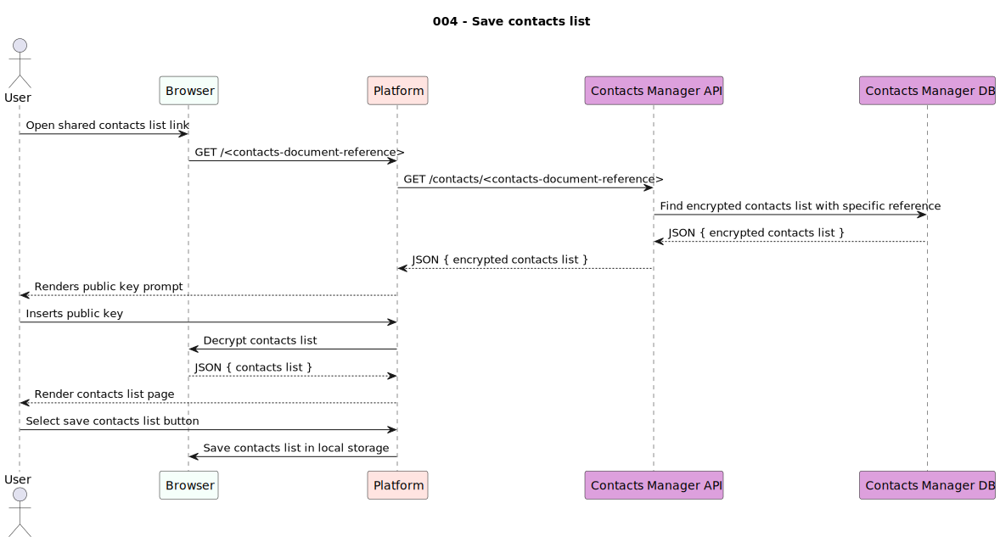

# usecases

This document keeps track of all use cases the project aims to deliver, including their description, requirements, scope and availability.

---

|Use Case|Scope|Integrated in|
|--------|-----|-------------|
|001 - Create contacts list|`User`|`Alpha`|
|002 - Share contacts list|`User`|`Alpha`|
|003 - View shared contacts list|`Viewer`|`Alpha`|
|004 - Save contacts list|`User`|`Alpha`|
|005 - Import contacts list|`User`|`Alpha`|

---

## 001 - Create contacts list

This use case enables the creation of a contacts list. The input must be a list of contact records and the output shall be a pair of **private** and **public** keys, as well as the document reference that identifies the encrypted contacts list.

**Inputs**:

- 1..* contact record

**Outputs**:

- 1x private key
- 1x public key
- 1x encrypted contacts document reference

---

## 002 - Share contacts list

This use case enables users to share their contacts list prior to creation. All users need to do is click the "share" button and the platform shall generate the shared link.

**Inputs**:

- 1x document refernece
- 1x document hash

**Outputs**:

- 1x shared contacts list URL

---

## 003 - View shared contacts list

This use case allows viewers to open a contacts list and use them. To execute this use case, the viewer will need the contacts list link and the public key to decrypt it, which must be shared by the user.

Viewers differ from users in the sense that these can only read the contacts list.

**Inputs**:

- 1x shared contacts list URL
- 1x public key 

**Outputs**:

- 1x decrypted contacts list

---

## 004 - Save contacts list

This use case is similar to use case [#002](#002---share-contacts-list) in the sense that the viewer only needs to click a button to save the contacts list (as a reference).

This use case can only be executed after use case [#003](#003---view-shared-contacts-list).

**Inputs**:

- 1x decrypted contacts list
- 1x shared contacts list URLs

**Outputs**:

- N/A

## 005 - Import contacts list

This use case triggers use case [#001](#001---create-contacts-list) and converts the viewer as a user who owns the newly imported database.

This use case can only be executed after use case [#003](#003---view-shared-contacts-list).

**Inputs**:

- 1..* contact record

**Outputs**:

- 1x private key
- 1x public key
- 1x encrypted contacts document reference

