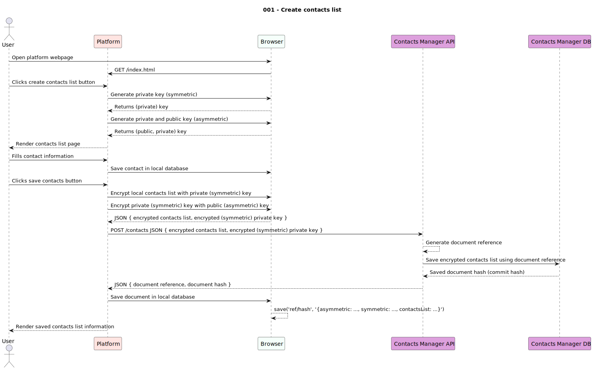

# usecases

This document keeps track of all use cases the project aims to deliver, including their description, requirements, scope and availability.

---

|Use Case|Scope|Integrated in|
|--------|-----|-------------|
|001 - Create contacts list|`User`|`Alpha`|
|002 - Share contacts list|`User`|`Alpha`|
|003 - View shared contacts list|`Viewer`|`Alpha`|
|004 - Save contacts list|`User`|`Alpha`|
|005 - Import contacts list|`User`|`Alpha`|

---

## 001 - Create contacts list

This use case enables the creation of a contacts list. The input must be a list of contact records and the output shall be a pair of **private** and **public** keys, as well as the link to where contacts have been saved.

**Inputs**:

- 1..* contact record

**Outputs**:

- 1x private key
- 1x public key
- 1x encrypted contacts list URL

---

## 002 - Share contacts list

**Inputs**:

- 

**Outputs**:

- 1x encrypted contacts list URL
- 1x public key

---

## 003 - View shared contacts list

**Inputs**:

- 1x encrypted contacts list URL
- 1x public key 

**Outputs**:

- 1..* contact record

---

## 004 - Save contacts list

**Inputs**:

- 

**Outputs**:

- 

## 005 - Import contacts list

**Inputs**:

- 

**Outputs**:

- 

