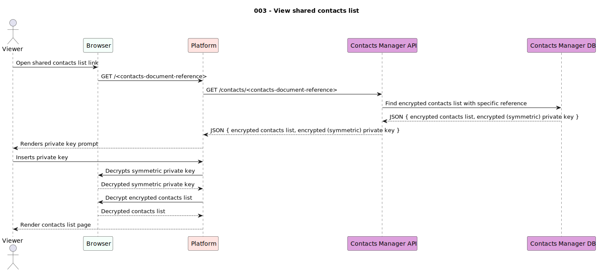

# usecases

This document keeps track of all use cases the project aims to deliver, including their description, requirements, scope and availability.

---

|Use Case|Scope|Integrated in|
|--------|-----|-------------|
|001 - Create contacts list|`User`|`Alpha`|
|002 - Share contacts list|`User`|`Alpha`|
|003 - View shared contacts list|`Viewer`|`Alpha`|
|004 - Save contacts list|`Viewer`|`Alpha`|
|005 - Import contacts list|`Viewer`|`Alpha`|

---

## 001 - Create contacts list

This use case enables the creation of a contacts list. The input must be a list of contact records and the output shall be a pair of **private** and **public** asymmetric keys, a **private** symmetric key, as well as the document reference that identifies the encrypted contacts list.

**Inputs**:

- 1..* contact record

**Outputs**:

- 1x private key (symmetric)
- 1x private key (asymmetric)
- 1x public key (asymmetric)
- 1x encrypted contacts document reference

---

## 002 - Share contacts list

This use case enables users to share their contacts list. Users need a public key (asymmetric) that the sharing user knows, and then click the "share" button.

**Inputs**:

- 1x document refernece
- 1x document hash
- 1x shared user public key (asymmetric)

**Outputs**:

- 1x shared contacts list URL

---

## 003 - View shared contacts list

This use case allows viewers to open a contacts list and use them. To execute this use case, the viewer will need the contacts list link and the private key (asymmetric) to decrypt it.

Viewers differ from users in the sense that these can only read the contacts list.

**Inputs**:

- 1x shared contacts list URL
- 1x private key 

**Outputs**:

- 1x decrypted contacts list

---

## 004 - Save shared contacts list

This use case is similar to use case [#002](#002---share-contacts-list) in the sense that the viewer only needs to click a button to save the contacts list.

This use case can only be executed after use case [#003](#003---view-shared-contacts-list).

**Inputs**:

- 1x decrypted contacts list
- 1x shared contacts list URLs

**Outputs**:

- N/A

## 005 - Import contacts list

TBD.

This use case can only be executed after use case [#003](#003---view-shared-contacts-list).

**Inputs**:

- 1..* contact record

**Outputs**:

- 1x private key
- 1x public key
- 1x encrypted contacts document reference

<!--  -->
